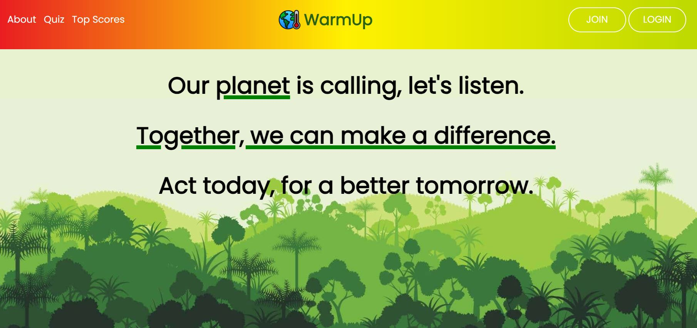
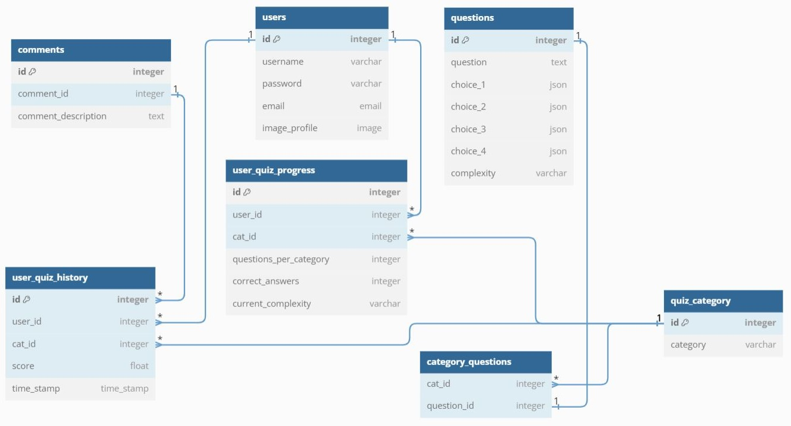
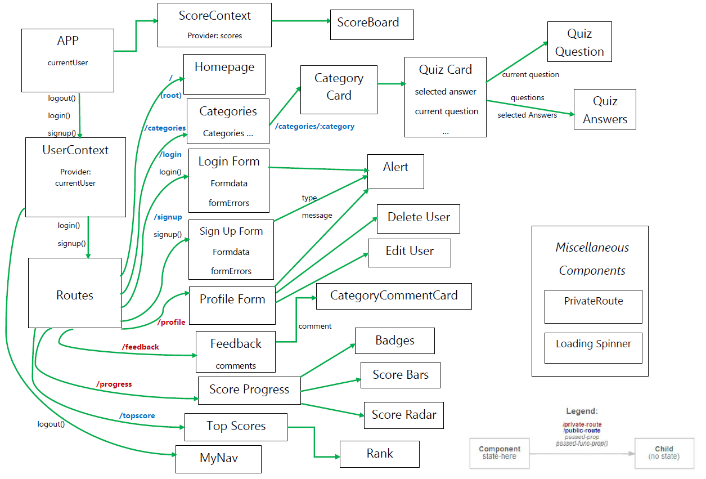

# WarmUp Quiz App 



## About WarmUp

### App Description
The WarmUp Quiz app focuses on climate change topics, providing users with a series of questions and challenges to test their environmental knowledge and awareness. I was the designer and developer responsible for creating the app's API, backend, and frontend components.

### Why WarmUp?

The app was designed to address the critical issue of climate change due to its profound impact on our planet's future. By focusing on this topic, I aim to educate and empower users to take meaningful actions to combat climate change and contribute to a more sustainable world.

### Walkthorugh of the Project: [Video](https://drive.google.com/file/d/1bpUy43MDPsINp4QQgKlHk9hIHnrKNc8b/view?usp=sharing)

## App Features

### - User Authentication & Authorization
This section allows users to register as WarmUp users with optional email and image profile settings, ensuring secure access to app features.

### - User Profile
Registered users have the capability to edit or delete their profiles, providing them with control over their account information.

### - Quiz Categories
WarmUp offers a comprehensive educational experience with six key climate change categories, each containing 15 questions of varying complexity. These categories include Plastic, Fossil Fuels, Deforestation, Agriculture, Transportation, and Food Production.

### - Scoreboard
The Scoreboard displays session scores, resetting each time the user starts a new session, enabling users to track their performance during each session.

### - Green Awards
Users who achieve over 80% in a category earn the "Green Award" badge, signifying their exceptional understanding of a particular climate change topic.

### - Feedback
Those with the "Green Award" badge gain access to the "Feedback Feature," allowing them to share their thoughts, solutions, and opinions related to specific climate issues.

### - Progress
In this section, users can monitor their overall progress, including the total number of quizzes taken, average scores, maximum scores for each category, and their progress over time in each category. It serves as a personal motivator to continuously enhance their knowledge of climate change.

### - Top Scores
This section serves as a hub for current rankings and the highest scores in each WarmUp category, fostering a sense of community and collaboration among users interested in addressing climate change. It also provides a platform for users to exchange their insights and solutions.


## Backend & API

### WarmUp Database Schema



### Backend
- Data storage: PostgreSQL database
- Server logic: Node.js with the Express.js web framework
- Security: JWT-based authentication
  
### API
- Endpoints: ```/auth```, ```/users```, ```/questions```, ```/quiz```, ```/comment```
- Authentication: JWT (JSON Web Tokens)
- Authorization: Role-based access control
- Response formats: JSON

## Frontend

### Component Hierarchy


## Addressing Key Challenges

### **1. Scores' Progress**

- **Problem**: 
  Storing current scores for each category in quizzes posed challenges in effectively managing and tracking scores over time. This hindered the analysis of progress and historical performance.
  
- **Solution**: 
  I introduced an additional table that stores all scores for completed quizzes over time. This table now enables the tracking of how scores change, improve, or decline for each user and category. I also redesigned the relationships between other tables to accommodate this update, creating a more robust and historical scoring system. This change enhances the ability to provide insights into user performance and better tailors assessments to user needs.


### **2. Efficient Data Consolidation for All Users**

- **Problem**: 
  On the frontend, while retrieving data from various tables didn't pose any issue, matching data for all users created a problem. This challenge resulted in difficulty in efficiently consolidating data for all users.
  
- **Solution**: 
  I overcame this issue by utilizing the concept of closures. I stored the required data in a variable within a closure, which allowed continued access to the data even after the loop had finished executing. This approach enabled the effective consolidation of data for all users, improving the efficiency of data retrieval and matching.


## What I learned?

I have gained valuable insights and learned the following key outcomes:

Backend Learning Outcomes:

1. **Authentication and Authorization**: I mastered implementing user authentication and authorization, ensuring that users can securely access the application's features. For example, I integrated JWT for user authentication and implemented role-based access control.

2. **RESTful API Design**: I learned how to design RESTful APIs for seamless communication between the frontend and backend. For instance, I designed well-structured endpoints for user registration, data retrieval, and resource updates.

3. **Database Query Optimization**: I acquired the skills to optimize database queries for faster data retrieval. An example includes using indexes and query optimization techniques.

Frontend Learning Outcomes:

1. **Performance Optimization**: I acquired the ability to enhance performance, reduce loading times, and manage side effects effectively by leveraging React hooks, including useEffect and useRef.

2. **Effective State Management**: I learned how to proficiently manage and manipulate state, ensuring data integrity and delivering a seamless user experience.

3. **Responsive Design**: I became proficient in creating responsive web designs that adapt to various screen sizes and devices by customizing Material UI components.


## Technical Stack

- Frontend
  - React.js
  - Material UI
  - Framer Motion
  - React VIS

- Backend
  - Express.js and Node.js

- Database
    - PostgreSQL


## Running code

To execute the code, follow these steps:

1. In the project directory, run the following command: </br>
```npm start```

2. This command runs the app in development mode.

3. To access the app locally, open your web browser and visit http://localhost:3000.


## Additional Note

Use the following credentials to access the app:

- Username: testuser
- Password: 123456